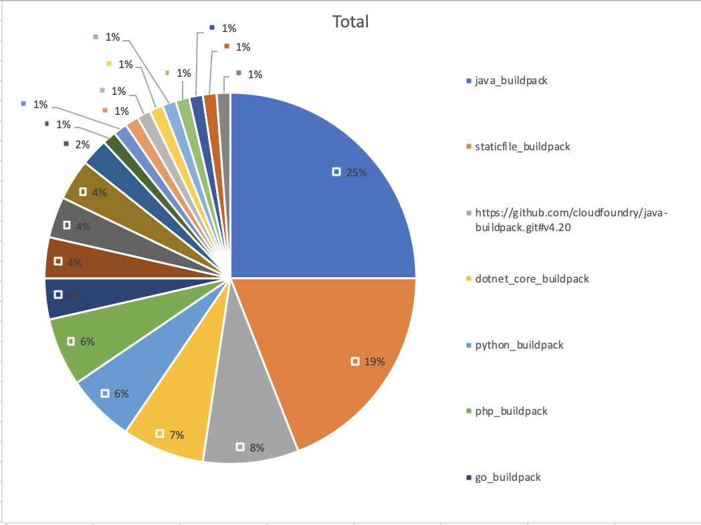

# cf-devops-metricr
Spring boot "KPIs-as-a-service" application that gathers data from a cloud foundry instance and generates KPI reports.

This project includes two applications.

* poi-storage  
A spring boot command line utility that runs on the local machine, connects to a cloud foundry instance, downloads event and other data via the cloud controller api and generates a excel file that contains KPIs.
* metricr  
A spring boot server side application that can run local or on cloud foundry, connects to a cloud foundry instance, downloads once a day new event and other data via the cloud controller api and stores the data in a DB service instance. Excel reports can be downloaded on demand via the rest api.  

Credentials are managed in a credhub (secure credential store) service instance.

Example: buildpack usage


# Prerequisite
* [Cloud Foundry user with Global Auditor Role](https://docs.pivotal.io/pivotalcf/2-3/concepts/roles.html#roles)

# Quick start
- clone this repo
````bash
git clone https://github.com/dflick-pivotal/cfdevopsmetricr.git
````
- cd into "cfdevopsmetricr"
````bash
cd cfdevopsmetricr
````
- run "./mvnw package" (linux) or "mvnw.cmd package" (windows)
````bash
./mvnw package
````
- klick [here](metricr) and follow the steps to run metricr
